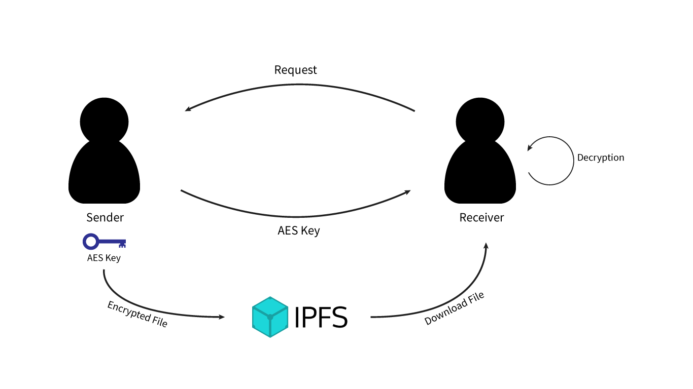
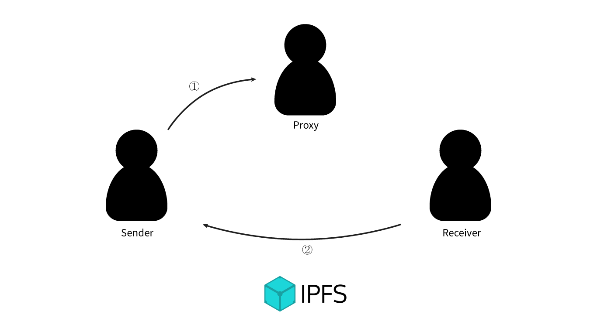
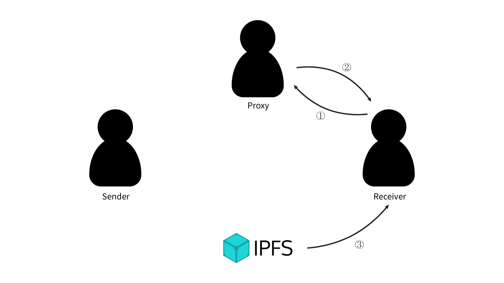

# Muzika Platform monorepo 

### Packages

*These packages are not published*

| Packages                                   | Version              | Description                                         |
| ------------------------------------------ | -------------------- | --------------------------------------------------- |
| [`@muzika/core`](/projects/core)           |       | the implementation of smart contract usage interfaces which will be used in Muzika platform layer |
| [`@muzika/core/angular`](/projects/core/angular)       |       | Angular library for Muzika platform                       |
| [`@muzika/core/browser`](/projects/core/browser)       |       | Streaming utils for Muzika platform                       |
| [`@muzika/core/nodejs`](/projects/core/nodejs)       | *Not published*      | NodeJS Interface for Electron, NodeJS server                       |

# Techniques

## File System

### File Download
악보 구매 후 사용자는 파일을 다운받기 위해 서버 또는 다른 사용자에게 파일을 요청하게 되는데 요청을 받은 서버 또는 사용자는 요청한 사용자가 악보를 구매했는지
블록체인 네트워크 상에서 확인을 한 후 파일을 보내주게 된다. 서로 통신을 할 때는 Block 또는 BlockRequest 라는 객체를 주고 받는다.

#### Block
파일의 데이터와 패딩 값이 들어가며, 통신을 할 때 요청을 받은 서버 혹은 다른 사용자가 요청한 사용자(requester)에게 보내주는 객체, 즉 response body 에
들어가는 객체이다. 요청자에게 보내줄 때는 무조건 파일을 암호화해서 보내준다.

#### BlockKey
암호화된 Block을 해독하기 위한 객체이다. 내부에는 Private Key 를 가지고 있으며, 이 키로 Block 의 AES 키 값을 구한 후에 AES 키 값으로 Block을
해독하고, 마지막으로 패딩을 없애서 원본 파일을 구할 수 있다.

#### BlockRequest
BlockKey에서 생성할 수 있는 객체로 서버 혹은 다른 사용자에게 파일을 요청할 때 필요한 객체이다. 내부에는 Public Key 가 존재하며, 요청을 받은 사용자는 파일을
Public Key로 암호화해서 암호화된 Block을 생성해서 response 해주고 요청자는 BlockRequest 를 생성한 BlockKey 를 가지고 복호화를 해서 파일을 얻을 수
있다.

### File Encryption / Decryption
Server, P2P 또는 IPFS[[1]] 상으로 파일을 요청 및 전송을 할 때 파일을 암호화할 필요가 있다. 암호화는 대칭키 암호화인 AES-256-CBC와 비대칭키 암호화인 RSA를
사용하며, RSA 암호화보다 더 적은 비트 수로 비슷한 수준의 보안성을 가지는 ECC(타원 곡선 암호 알고리즘)도 지원할 예정이다.

파일을 요청할 때는 BlockRequest 객체를 보내주고 파일을 건내줄 때는 암호화된 Block 을 넘겨주는데 파일을 건내주는 서버나 피어(Peer)는 요청자가 보낸
BlockRequest 안에 있는 Public Key를 이용하여 파일을 패딩 및 암호화해서 암호화된 객체를 생성 후에 보내준다. 암호화하는 방법은 다음과 같다.

String Concatenation을 다음과 같이 표기한다면

  

Muzika 사용자가 서버 또는 다른 피어(Muzika 사용자) 또는 IPFS에 contract 의 파일을 요청(request)하면 서버 또는 피어는 블록체인 네트워크 상의 contract를
확인해서 그 사용자가 구매를 했는지 확인 후 암호화된 Block 객체를 보내주게 된다.

블록 암호 운용 방식(block cipher modes of operation)은 하나의 키(여기서는 AES 키)로 블록 단위로 암호화하는 방식을 의미하는 것으로 블록 단위로 암호화
하기때문에 데이터의 크기가 블록 크기의 배수가 되어야 한다. 따라서 원본 데이터가 블록 크기의 배수가 아닐 수도 있으므로 블록 크기에 맞게 뒤에 패딩을 붙여주어야 한다.
현재 Muzika에서는 블록 크기를 16 bytes 로 했기 때문에 16의 배수인 경우 16 bytes 짜리 패딩을, 16의 배수가 아닌 경우 16 - (len(data) mod 16) bytes
의 크기만큼 붙여준다. 이 때 패딩 안에 있는 각각 바이트의 값은 패딩 크기와 동일하다.

블록 암호 운용 방식은 CBC(Cipher Block Chain) Mode를 사용하며, 블록 암호화를 하기 전에 데이터의 앞과 뒤에 랜덤한 크기와 랜덤한 값의 패딩을 넣게 된다. 이는
Known-plain attack(해커가 원본 값과 암호화된 값을 알고 있을 경우 그것을 통해 key를 유추하는 방법)을 방지하기 위함으로 대부분의 파일 포맷은 처음에 동일한 값을
갖는 Signature, Version 등 헤더가 있기 때문에 파일이 암호화되어 있어도 파일의 맨 앞에 있는 헤더의 Signature 등을 통해 암호화된 바이트 값과 평문 바이트 값을
유추할 수 있다. AES 암호화의 경우 Known-plain Attack에 내성(resistant)을 가지고 있으나 보안 강화를 위해(암호화된 데이터에서 실제 데이터의 시작점이
어디에 있는지 모르게 하기 위해) 넣는다.

  

  

  

  

이라고 정의할 때 원본 데이터에서 블록 데이터로 바꿔주는 함수 B는

  

where

  

원본 데이터에서 앞 뒤로 Random Bytes가 들어가 있는 Garbage Padding을 넣어주게 된다. 앞에 있는 Garbage Padding을 Front Garbage Padding, 뒤에 있는
Garbage Padding을 Back Garbage Padding 이라고 할 때, 앞 뒤의 Garbage Padding 크기의 합은 255 bytes이며, 블록 맨 앞에 복호화 할 때 Garbage
Padding을 없앨 때 필요한 Front Garbage Padding 의 크기를 나타내는 값이 1 byte 크기로 들어가있다.

이 블록을 랜덤으로 생성한 AES-256 Key로 암호화하며, CBC 모드에서 필요한 initializer vector 값과 요청자가 같이 보낸 RSA Public Key로 AES 키를
암호화한다.

  

이로써 암호화된 블록이 완성되었으며 requester 에게 이 블록을 보내준다. 요청자는 암호화된 블록을 받으면 앞의 256 비트를 RSA Private Key로 해독하고, 거기에서
얻은 AES-Key 값으로 블록 데이터를 해독 후 Padding 을 없애서 원본 파일을 얻을 수 있다.

## Proxy Re-encryption [[2]]
우선 파일 암호화를 통하여 판매자와 구매자간에 **P2P**로 연결하여 파일을 주고받는 상황을 생각해보자.

Alice와 Bob이 거래를 할 때, 먼저 Alice는 *AES*와 같은 대칭키 암호화를 통해 파일 시스템에 올린다. 그런 뒤 Alice가 Bob에게 해당 대칭키를 넘겨주어 파일을 복호화할 수 있다. 

판매자와 구매자간의 P2P 거래는 안전하고 확실한 방법이 될 수 있지만, 두 거래 당사자가 서로 온라인 상태이어야 한다. 그리고 다수의 구매자와 다수의 판매자 사이에서 거래가 이루어지도록 하기 위해서는 각각의 파일을 암호화하여 모든 구매자에게 각각 대칭키를 넘겨주어야 하기 때문에 복잡한 절차가 아닐 수 없다.

  

For Alice  

  

For Bob  

  

where

  

### Proxy Re-encryption (PRE)
두 거래 당사자가 온라인상태가 아니여도 거래가 이루어지도록 하려면 Alice와 Bob 이외에 언제나 온라인 상태인 Proxy가 있어야 한다.
먼저 Alice가 대칭키를 이용하여 암호화하고, 대칭키를 자신의 **공개키**로 암호화하여 암호화된 파일과 키를 파일시스템에 저장한다. 그런 뒤 Alice는 Bob에게 암호화된 키를 넘겨주지 않고, Proxy에게 Re-encryption Key를 전송한다. 이 Key는 오로지 Bob만이 **자신의 개인키로 복호화할 수 있도록** 재암호화를 하는 역할로 이용된다.

  

Bob은 파일시스템에서 암호화된 파일을 다운받고, Proxy에게 **재암호화된** 키를 받는다. 이때 Proxy는 Alice에게서 받은 Bob의 Re-encryption Key를 이용하여 파일 시스템상에 있는 암호화된 키를 재암호화 하여 Bob에 전송한다.
그리고 Bob은 자신의 **개인키**를 이용하여 암호화된 키를 해독하여 파일의 복호화키를 얻어 복호화할 수 있다.
이 과정에서는 모두 Alice와 Bob은 자신의 개인키가 공개될 우려를 하지 않아도 되며, Proxy는 Re-encryption key만 가지고 있기 때문에 Alice의 암호화된 메시지를 해독하여 볼 수 없다는 점에서 훌륭한 대안법이 될 수 있다.

  

For Alice

  

Alice Send to Proxy

  

For Proxy

  

For Bob

  

### Trustful Proxy (Transfer Delegation)
위에서 언급한 PRE은 암호화된 파일을 전송하는데 아주 훌륭한 기법이다. 하지만 Alice가 구매자 각각의 Re-encryption Key를 Proxy에게 전송해야하기 때문에 확장성 문제가 발생한다.
PRE의 중요한 특성중 하나가 재암호화를 **여러번 적용 가능**하다는 점이다. 예를 들어 Alice가 Bob에게 Rekey를 넘겨주면, Bob은 다시 Chris에게 Rekey를 넘겨 Chris가 Alice의 파일을 복호화할 수 있다.
우리는 PRE를 두 거래 당사자가 오프라인 상태에서 파일을 주고받는 역할로 사용되는 것이 아닌 Re-encryption에 더욱 초점을 맞추어 파일 거래가 안전하게 이루어지도록 한다.

Alice는 **신뢰할 수 있는** Proxy에게 Proxy의 개인키를 사용하여 재암호화키를 생성하여 보내면, Alice의 컴퓨터가 켜져있지 않아도 Proxy가 직접 구매자에게 파일을 전송할 수 있게 된다. 이 과정에서도 역시 Alice의 개인키는 공개되지 않고 거래를 이룰 수 있지만,
Proxy가 신뢰할 수 없는 존재라면 재암호화키를 이용하여 악의적인 행동을 취할 수 있다는 단점이 있다.

Alice send re-encryption key to Proxy

  

For Proxy

  

  

우리 Muzika는 파일을 주고받는 상황에서 **신뢰할 수 있는** 중개자 역할로서 재암호화키가 유출되지 않도록 보안에 강력히 대응하고 악보 판매가 원활이 이루어 질 수 있도록 한다.

더 나아가 탈중앙화 키 관리 시스템을 연구하여 완벽한 탈중앙화를 이룰 수 있도록 할 것이다.

## Community
사용자가 악보를 사고 팔 수 있는 Platform 을 의미한다. 사용자는 지갑을 통해 로그인을 하고, 글 작성, 파일 열람, contract 생성, 댓글 작성 등을 할 수 있다.

#### Login System
사용자는 Metamask, Trezor, Private Key 직접 입력 등을 통해 다양한 방법 중 하나를 선택해서 로그인할 수 있다. 로그인을 할 때는 패스워드 입력이 아닌 지갑을
통해 하게 되므로 대부분의 웹 사이트의 로그인 방식과 다르다. 서버는 지갑의 Private Key를 소유하지 않으며, Signing / Validation 을 통해 로그인을 하게 된다.

서버는 Redis 등 sign message 를 임시로 발급하기 위한 캐시 서버가 존재하며, 사용자가 로그인하기 전에 서버에 지갑 주소(Public Key)를 보내면 Wallet
Address를 인덱스로 갖는 일정한 크기의 랜덤 메시지를 생성하고, 사용자는 그 메시지를 받아서 Signing 해서 서버에게 보낸다. 서버는 Signing 한 것이 valid 한지
체크한 후에 유효하면 로그인을 성공시킨다.

Sign Message 를 서버에서 랜덤으로 생성하기 때문에 사용자는 timeout 되기 전까지 Signing을 해서 보내야 하기 때문에 악의의 사용자가 Private Key를 갖지 않는
이상 시간 안에 Brute-force Attack 등을 이용하여 Signing 하는 것은 불가능에 가깝다. 또한 악의의 사용자가 일부 메시지에 대한 Signing 값을 알고 있더라도 서버가
생성한 Sign Message로 인증을 해야하기 때문에 캐시 서버가 그 지갑 주소에 대한 Sign Message가 해커가 알고 있는 Sign message가 될 때까지 무작정 Brute Force
Attack으로 요청을 해야하는데, 생성될 수 있는 총 Sign Message 수는![][numSign] 개이기 때문에 불가능에 가깝다.

[numSign]: https://latex.codecogs.com/gif.latex?%5Cinline%20%5Cfn_jvn%2062%5E%7B20%7D%20%5Capprox%207%20%5Ctimes%2010%5E%7B35%7D

## Muzika

Muzika는 악보를 구매하거나 판매할 때 사용되는 화페이며, 이더리움 블록체인 위에서 수행하는 [ERC20][ERC20] 기반의 토큰이다.

### Token Information

| Muzika       | ERC20 Standard  |
|--------------|-----------------|
| Name         | Muzika          |
| Symbol       | MZK             |
| Decimals     | 18              |
| Total Supply | 100,000,000 MZK |

## Decentralized Crowd Funding
아티스트는 악보 및 음원 제작에 필요한 경비를 크라우드 펀딩으로 사용자들에게 토큰을 투자받을 수 있다.
크라우드 펀딩을 위한 컨트랙트를 블록체인에 공개되어 위/변조의 위험을 막고 안전하게 투자를 받을 수 있도록 한다.
크라우드 펀딩과 투자자들에게 돌아가는 금액 역시 자동으로 결정되고 지급되도록 하여 trustless 한 crowd funcding이 되도록 한다.

## Reward (Loyalty Point)
유저들은 커뮤니티 활동을 통하여 일정량의 보상을 Loyalty Point로 받게 된다. Loyalty Point는 일정 시간마다 Muzika 토큰으로 환전이 가능하며, 그 비율은 초기에는 시장 경제에 따른 비율로 지급하고, 이후에는 머신러닝을 이용하여 비율이 자동 결정되도록 한다.
환전 역시 블록체인상에 존재하는 스마트 컨트랙트로 관리되어 환전 기록이 공개적으로 남게된다.
커뮤니티 활동으로는 게시글 등록 및 좋아요, 댓글 작성, 음악 판매 등 여러 항목이 존재하고, 수시로 변경되는 값이기 때문에 온체인으로 바로 올리지 않고 오프체인으로 관리하였다가 한번에 트랜잭션 처리를 통해 네트워크 수수료를 절약하도록 한다.

# References
[[1]] IPFS - Content Addressed, Versioned, P2P File System, [github](https://github.com/ipfs/ipfs)  
[[2]] Proxy Re-Encryption, https://en.wikipedia.org/wiki/Proxy_re-encryption  
[[3]] NuCypher KMS: Decentralized key management system  

<!-- References -->
[1]: https://github.com/ipfs/ipfs/blob/master/papers/ipfs-cap2pfs/ipfs-p2p-file-system.pdf?raw=true
[2]: https://en.wikipedia.org/wiki/Proxy_re-encryption
[3]: https://www.nucypher.com/whitepapers/english.pdf

<!-- Links -->
[ERC20]: https://theethereum.wiki/w/index.php/ERC20_Token_Standard
