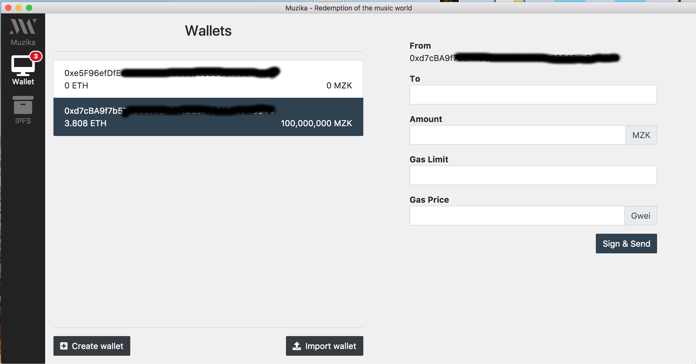
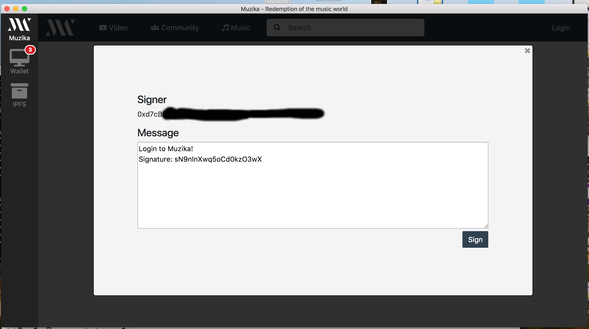
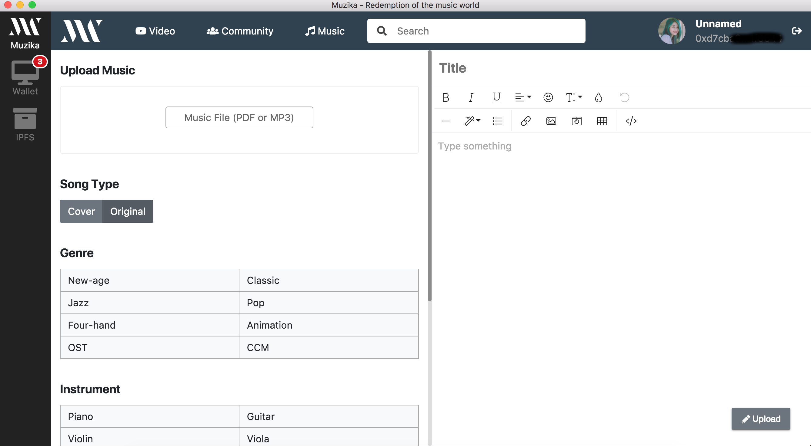

# Muzika Viewer

## Installation
```bash
$ git clone https://github.com/MuzikaFoundation/muzika-platform.git
$ cd muzika-platform/
$ npm install
$ npm run contract:compile
$ npm run start:viewer:stage
```

## Screenshot






